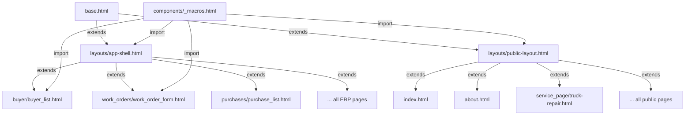

# BEW Frontend Architecture Blueprint — Part 1/5
# Executive Summary, Audit Findings & Current Architecture Problems

---

## 1. Executive Summary

Bangladesh Engineering Workshop (BEW) operates a dual-purpose web application:
1. **Internal ERP** — Purchase orders, work orders, sales, inventory, buyer management
2. **Public Corporate Website** — Service pages, shop directory, about/contact pages

The backend (Flask + Jinja2 + SQLite) is professionally built and running in production. However, the frontend has accumulated severe technical debt that blocks scalability, theming, SEO, and maintainability.

### Key Metrics (Validated Against Source Code)

| Metric | Count | Severity |
|:-------|------:|:--------:|
| CSS files (global + per-page) | 18 | 🔴 |
| Total CSS lines | 3,231 + 1,090 per-page = **4,321** | 🔴 |
| `@import` waterfall depth | 10 blocking HTTP requests | 🔴 |
| Inline `style=""` attributes | **500+** across templates | 🔴 |
| Embedded `<style>` blocks | 5 templates | 🟡 |
| Inline `<script>` blocks | 679 lines across 8 templates | 🔴 |
| Duplicate CSS class definitions | `.page-header`, `.glass-search-form`, `.pagination`, `.badge`, `.detail-card`, `.grid-*` duplicated in `layout.css` AND `themes.css` | 🔴 |
| Duplicate Jinja2 macros | `unit_options()` in 2 files | 🟡 |
| Hardcoded hex colors in templates | `#475569`, `#0ea5e9`, `#25d366`, `#333333`, `#64748b`, `#1e293b`, `#f1f5f9`, `#ef4444` etc. | 🔴 |
| Schema.org / JSON-LD markup | **0** pages | 🔴 |
| `<meta description>` tags | **0** pages | 🔴 |
| ARIA attributes | **0** across codebase | 🔴 |
| `!important` overrides in CSS | 40+ occurrences across 5 files | 🟡 |

### Verdict
> The frontend is **functional but architecturally bankrupt**. Every new page or feature adds compounding technical debt. A structured, phased migration to a token-driven design system with Tailwind CSS + Alpine.js is the only sustainable path forward.

---

## 2. Audit Findings (Validated Against Source Code)

### 2.1 CSS Architecture — Critical Failures

#### Problem A: `@import` Waterfall (10 Blocking Requests)

```
style.css (master)
 └─ @import variables.css      ← HTTP request 1
 └─ @import themes.css         ← HTTP request 2 (630 lines!)
 └─ @import base.css           ← HTTP request 3
 └─ @import layout.css         ← HTTP request 4
 └─ @import shop_list.css      ← HTTP request 5
 └─ @import shop_form.css      ← HTTP request 6
 └─ @import shop_detail.css    ← HTTP request 7
 └─ @import responsive-table.css ← HTTP request 8
 └─ @import extra.css          ← HTTP request 9
 + <link> buttons.css          ← HTTP request 10
 + per-page <link> CSS files   ← HTTP request 11-14
```

**Impact:** Each `@import` is a **render-blocking sequential HTTP request**. On a 3G connection, this causes 3-5 seconds of FOUC (Flash of Unstyled Content). The browser cannot parallelize `@import` chains.

#### Problem B: Massive CSS Duplication

The following classes are **defined identically** in both `layout.css` and `themes.css`:

| Class | `layout.css` Lines | `themes.css` Lines | Status |
|:------|:--:|:--:|:---:|
| `.page-header` | 232-268 | 401-436 | 🔴 Exact duplicate |
| `.glass-search-form` | 271-311 | 438-479 | 🔴 Exact duplicate |
| `.pagination` | 327-362 | 494-530 | 🔴 Exact duplicate |
| `.badge` / `.badge-info` | 313-324 | 481-492 | 🔴 Exact duplicate |
| `.detail-card` / `.detail-grid` | 213-230 | 552-569 | 🔴 Exact duplicate |
| `.grid-2/3/4` | (in `variables.css`) | 313-340 (themes.css) | 🔴 Triple definition |
| `.erp-form-card` | (in `variables.css`) | 274-281 (themes.css) | 🔴 Double definition |
| `.company-link` | 364-371 | 532-540 | 🔴 Exact duplicate |

**Root Cause:** `themes.css` was meant to hold only color tokens, but evolved into a copy-paste dump of shared component styles from `layout.css`.

#### Problem C: Token Violations (Hardcoded Values)

Files that bypass the `variables.css` design token system:

| File | Violation |
|:-----|:----------|
| `themes.css` L289 | `gap: 20px` instead of `var(--gap-md)` |
| `themes.css` L329 | `gap: 15px` instead of `var(--gap-sm)` |
| `extra.css` L6 | `gap: 20px` hardcoded |
| `extra.css` L35-48 | 6× `!important` overrides on `.service-box` |
| `shop_detail.css` | `#0ea5e9`, `#25d366` (WhatsApp green) hardcoded |
| `shop_form.css` | Pixel dimensions not using spacing tokens |

#### Problem D: `!important` Epidemic

```
variables.css:  8 occurrences (margin utilities)
buttons.css:   12 occurrences (action button overrides)
extra.css:     11 occurrences (service boxes + width utilities)
themes.css:     9 occurrences (form labels, service boxes)
```

**Total: 40+ `!important` flags** creating a specificity war that makes CSS changes unpredictable.

---

### 2.2 JavaScript Architecture — Critical Failures

#### Problem A: Monolithic `script.js` (181 lines)

The global script mixes 6 unrelated concerns in one DOMContentLoaded handler:

```
script.js
 ├─ Sidebar toggle logic (L3-27)
 ├─ Flash message auto-dismiss (L29-37)
 ├─ Search input focus effects (L39-49)
 ├─ Delete confirmation dialogs (L51-62)
 ├─ Category select toggle (L85-107)
 ├─ Theme switcher (L109-128)
 └─ Live search with debounce (L131-180)
```

**All of these should be Alpine.js components**, not imperative DOM manipulation.

#### Problem B: 679 Lines of Inline `<script>` Blocks

| Template | Lines | What It Does |
|:---------|------:|:-------------|
| `work_order_form.html` | 128 | Dynamic parts array, cost calc, file mapping |
| `buyer_form.html` | 129 | Dynamic contact rows, mobile add/remove |
| `shop_form.html` | 162 | Tag CRUD, gallery upload, category toggle |
| `work_order_detail.html` | 90 | PDF preview modal, pdf.js thumbnail |
| `purchase_form.html` | 55 | Dynamic purchase items |
| `sale_form.html` | 37 | Inventory search, item rows |
| `shop_detail.html` | 12 | Gallery lightbox |
| `inventory_form.html` | 4 | Autocomplete |

**Critical Anti-Pattern in `work_order_form.html`:** Uses `<template>` elements with `cloneNode()` — which is a correct pattern, BUT the cloned templates still contain inline `style="font-size: 14px;"` attributes (80+ occurrences), and the JS uses imperative `document.querySelectorAll` chains instead of Alpine.js reactivity.

**Positive Finding:** `work_order_form.html` uses `<template>` tags correctly (not JS backtick strings) for dynamic rows. This is better than `purchase_form.html` which attempts Alpine.js (`x-data="purchaseItems()"`) but mixes it with raw DOM manipulation.

---

### 2.3 Template Architecture — Critical Failures

#### Problem A: Inline Style Epidemic

**Worst Offender:** `work_order_detail.html` — **80 inline `style=""` attributes**

Example from lines 81-89 (actual code):
```html
<div style="margin-bottom: 1.5rem; padding-bottom: 1rem; border-bottom: 1px solid #f1f5f9;">
    <div style="font-size: 0.85rem; color: #475569; line-height: 1.6;
                background: #f8fafc; padding: 10px; border-radius: 6px;
                border: 1px solid #e2e8f0;">
```

Every single value here has a Tailwind equivalent or should use a CSS variable. The hardcoded hex colors (`#475569`, `#f8fafc`, `#e2e8f0`, `#f1f5f9`) will **break completely** under dark/matrix themes.

#### Problem B: 305-line Inline Style Monster

Line 305 of `work_order_detail.html` is a single `<div>` with an inline style containing **13 CSS properties**:
```html
<div style="background: linear-gradient(to right, rgba(14, 165, 233, 0.12), rgba(255, 255, 255, 0.05));
            backdrop-filter: blur(12px); -webkit-backdrop-filter: blur(12px);
            border: 1px solid rgba(14, 165, 233, 0.15); color: #0c4a6e;
            padding: 1rem 1.75rem; border-radius: 14px; display: flex;
            justify-content: space-between; align-items: center;
            margin-top: 1.5rem; box-shadow: 0 8px 32px rgba(14, 165, 233, 0.05);">
```

This is a **total-cost summary strip** that should be a reusable Jinja2 macro.

#### Problem C: Duplicate Macro Definitions

`unit_options()` macro is defined identically in:
- `work_orders/work_order_form.html` (line 23)
- `purchase/purchase_form.html` (line 20)

Both contain the same 13 unit options. This should be extracted to a shared macros file.

#### Problem D: Service Pages — Zero SEO Architecture

All 7 service pages (`truck-repair.html`, `heavy_engineering.html`, etc.):
- ❌ No `<meta name="description">` tag
- ❌ No canonical URL
- ❌ No Open Graph / Twitter Card tags
- ❌ No JSON-LD / Schema.org markup (`Service`, `LocalBusiness`)
- ❌ No `BreadcrumbList` structured data
- ❌ Hardcoded English text (not using `{{ _() }}` i18n tags)
- ❌ Inline `style=""` for all layout (e.g., `style="width: 100%; height: 350px;"`)
- ❌ Heading hierarchy violations (H1 → H2 → H3 is correct, but H4 used for CTA sections)

**Example from `truck-repair.html`:**
```html
<h3 class="reference-text" style="font-weight: 400; color: #333333; margin-bottom: 1rem;">
```
- `#333333` is a hardcoded color that ignores theme tokens
- `style="font-weight: 400"` overrides the semantic H3 default
- No `{{ _() }}` wrapper — content is not translatable

---

### 2.4 SEO Analysis — Zero Implementation

| SEO Feature | Status | Pages Affected |
|:------------|:------:|:--------------|
| Dynamic `<title>` | ✅ Partial | Most pages use `` |
| `<meta description>` | ❌ None | ALL pages — 0 descriptions |
| Canonical `<link>` | ❌ None | ALL pages |
| Open Graph tags | ❌ None | ALL pages |
| Twitter Card tags | ❌ None | ALL pages |
| JSON-LD `Organization` | ❌ None | Homepage, About |
| JSON-LD `LocalBusiness` | ❌ None | Contact/About |
| JSON-LD `Service` | ❌ None | 7 service pages |
| JSON-LD `BreadcrumbList` | ❌ None | ALL pages |
| Semantic HTML5 | ⚠️ Partial | `<main>` used, but `<article>`, `<section>` missing |
| Heading hierarchy | ⚠️ Partial | Some pages skip H2→H4 |
| `alt` text on images | ⚠️ Partial | Some images lack descriptive alt |
| `robots.txt` | ❌ None | No file found |
| `sitemap.xml` | ❌ None | No file found |

---

### 2.5 Accessibility Analysis — Near-Zero Implementation

| A11y Feature | Status |
|:-------------|:------:|
| ARIA roles (`role`, `aria-label`, `aria-expanded`) | ❌ None |
| `aria-label` on icon buttons | ❌ None — screen readers cannot interpret `<span class="material-icons">menu</span>` |
| Focus management on modals | ❌ None — preview modal traps no focus |
| Keyboard navigation for dropdowns | ❌ None — ERP dropdown is hover-only (`:hover`) |
| Skip-to-content link | ❌ None |
| Color contrast ratios | ⚠️ Untested — `--text-muted` (#475569) on white may fail WCAG AA |
| Form labels linked to inputs | ✅ Most forms use `for=""` attributes |
| Alt text on images | ⚠️ Partial |

---

### 2.6 Performance Analysis

| Issue | Impact | Root Cause |
|:------|:------:|:-----------|
| 10 sequential CSS `@import` calls | 🔴 High | `style.css` master importer |
| 4 external font requests (Google Fonts + Material Icons) | 🟡 Medium | 2 separate `<link>` tags |
| Tailwind CDN (~300KB uncompressed) | 🟡 Medium | Runtime JIT compilation |
| Alpine.js CDN | 🟢 Low | 15KB gzipped |
| pdf.js loaded on detail pages | 🟡 Medium | 290KB library for thumbnail |
| No image lazy loading | 🟡 Medium | Gallery images load eagerly |
| No CSS/JS minification | 🟡 Medium | Development assets served raw |

---

## 3. Current Architecture Problem Summary

### 3.1 The CSS Dependency Graph (Broken)

```mermaid
graph TD
    A[style.css] -->|@import| B[variables.css]
    A -->|@import| C[themes.css - 630 lines!]
    A -->|@import| D[base.css]
    A -->|@import| E[layout.css]
    A -->|@import| F[shop_list.css]
    A -->|@import| G[shop_form.css]
    A -->|@import| H[shop_detail.css]
    A -->|@import| I[responsive-table.css]
    A -->|@import| J[extra.css]

    K[buttons.css] -.->|separate link| L[base.html]
    M[per-page CSS] -.->|extra_css block| L

    C -->|DUPLICATES| E
    B -->|DUPLICATES| C
    J -->|DUPLICATES| C

    style C fill:#fee2e2,stroke:#ef4444
    style E fill:#fef3c7,stroke:#f59e0b
    style B fill:#fef3c7,stroke:#f59e0b
```

### 3.2 Root Cause Analysis

| Problem | Root Cause | Consequence |
|:--------|:-----------|:------------|
| CSS duplication | No single source of truth for components | Changes must be made in 2-3 places |
| Inline styles | No utility class system for one-off spacing/colors | Templates become unreadable |
| JS spaghetti | No reactive framework for dynamic DOM | Copy-paste "add row" logic in 4 forms |
| Theme breakage | Hardcoded hex colors in templates | Dark mode renders colored text invisible |
| SEO absence | No architectural blocks for meta/schema | Zero search engine visibility for service pages |
| No reusability | Components defined inline, not as macros | Every page reinvents buttons, cards, tables |

---

# BEW Frontend Architecture Blueprint — Part 2/5
# Proposed Architecture, Design Token System & Theme Architecture

---

## 4. Proposed Frontend Architecture

### 4.1 Architecture Principles

```
┌─────────────────────────────────────────────────────────────┐
│                    DESIGN TOKEN LAYER                        │
│  tokens.css → CSS Variables (Single Source of Truth)         │
├─────────────────────────────────────────────────────────────┤
│                    THEME LAYER                               │
│  [data-theme] selectors override token values                │
├─────────────────────────────────────────────────────────────┤
│                    TAILWIND MAPPING LAYER                    │
│  tailwind.config → maps CSS vars to utility classes          │
├─────────────────────────────────────────────────────────────┤
│                    COMPONENT LAYER                           │
│  Jinja2 Macros → consume tokens via Tailwind utilities       │
├─────────────────────────────────────────────────────────────┤
│                    LAYOUT LAYER                              │
│  app-shell.html (ERP) / public-layout.html (Website)        │
├─────────────────────────────────────────────────────────────┤
│                    PAGE LAYER                                │
│  Individual page templates extend layouts                    │
├─────────────────────────────────────────────────────────────┤
│                    BEHAVIOR LAYER                            │
│  Alpine.js stores + page-specific x-data components          │
└─────────────────────────────────────────────────────────────┘
```

### 4.2 Proposed Directory Structure

```
static/
├── css/
│   ├── tokens.css              ← ALL design tokens (replaces variables.css + themes.css tokens)
│   ├── components.css          ← Shared component styles that Tailwind can't express
│   │                              (responsive-table card layout, custom file upload, pdf modal)
│   └── legacy.css              ← [MIGRATION ONLY] Scoped old CSS during transition
│
├── js/
│   ├── alpine-store.js         ← Alpine.data() registrations + global stores
│   ├── alpine-components/      ← Per-feature Alpine components
│   │   ├── dynamic-form.js     ← Shared "add/remove row" pattern (replaces 4 inline scripts)
│   │   ├── preview-modal.js    ← PDF/image preview modal
│   │   ├── theme-switcher.js   ← Theme toggle + localStorage persistence
│   │   └── live-search.js      ← Debounced search with results dropdown
│   └── vendor/                 ← Third-party (pdf.js loaded conditionally)
│
├── img/                        ← Unchanged
└── uploads/                    ← Unchanged

templates/
├── base.html                   ← Master layout (CDN links, meta blocks, theme init)
├── layouts/
│   ├── app-shell.html          ← ERP layout (extends base.html, adds sidebar + nav)
│   └── public-layout.html      ← Public site layout (extends base.html, adds marketing nav)
│
├── components/                 ← Jinja2 Macro library
│   ├── _macros.html            ← Master macro file (imports all below)
│   ├── _buttons.html           ← btn(), btn_action(), btn_group()
│   ├── _cards.html             ← section_card(), stat_card(), detail_card()
│   ├── _forms.html             ← form_input(), form_select(), form_textarea(), unit_options()
│   ├── _tables.html            ← data_table(), responsive_table()
│   ├── _modals.html            ← preview_modal(), confirm_modal()
│   ├── _navigation.html        ← breadcrumb(), page_header(), pagination()
│   ├── _badges.html            ← badge(), status_badge()
│   ├── _alerts.html            ← flash_messages(), alert()
│   └── _seo.html               ← json_ld(), og_tags(), meta_tags(), breadcrumb_schema()
│
├── partials/                   ← Reusable HTML fragments (non-macro)
│   ├── _navbar.html            ← Main navigation bar
│   ├── _sidebar.html           ← Category sidebar
│   └── _footer.html            ← Site footer
│
├── buyer/                      ← Unchanged directory structure
├── inventory/
├── purchase/
├── sales/
├── shop/
├── work_orders/
├── service/
├── service_page/
└── errors/
```

### 4.3 Template Inheritance Strategy



**Block inheritance chain:**

```
base.html defines:
  
          ← NEW
             ← NEW
                   ← NEW
                   ← NEW
  
                ← NEW (for per-layout body classes)
  
  
  
                  ← NEW

app-shell.html overrides:
   → ERP navbar + sidebar
   → Minimal ERP footer
  Adds: , 

public-layout.html overrides:
   → Marketing navbar (no sidebar)
   → Full corporate footer
  Adds: , 
```

---

## 5. Design Token System

### 5.1 `tokens.css` — Complete Token Specification

```css
/* ═══════════════════════════════════════════════════════════════
   BEW Design Token System — Single Source of Truth
   
   RULE: No CSS file, no Tailwind class, no inline style may
   use a hardcoded value for any property listed here.
   All values MUST reference these variables.
   ═══════════════════════════════════════════════════════════════ */

:root {
    /* ── 1. COLOR TOKENS ─────────────────────────────────────── */

    /* Brand */
    --color-primary:        #2563eb;
    --color-primary-dark:   #1e40af;
    --color-primary-light:  #dbeafe;

    /* Semantic */
    --color-success:        #10b981;
    --color-success-light:  rgba(16, 185, 129, 0.1);
    --color-warning:        #f59e0b;
    --color-warning-light:  rgba(245, 158, 11, 0.1);
    --color-danger:         #ef4444;
    --color-danger-light:   rgba(239, 68, 68, 0.1);
    --color-info:           #0ea5e9;

    /* Neutral (Surfaces) */
    --color-bg:             #f1f5f9;
    --color-surface:        #ffffff;
    --color-card:           #ffffff;
    --color-input:          #ffffff;
    --color-footer:         rgba(255, 255, 255, 0.7);

    /* Neutral (Text) */
    --color-text:           #0f172a;
    --color-text-muted:     #475569;
    --color-text-inverse:   #f8fafc;

    /* Neutral (Borders) */
    --color-border:         #e2e8f0;
    --color-border-hover:   #cbd5e1;
    --color-border-subtle:  #f1f5f9;

    /* Interactive (Buttons) */
    --color-btn-primary:    #3b82f6;
    --color-btn-danger:     #ef4444;
    --color-btn-orange:     #ea580c;
    --color-btn-secondary:  var(--color-surface);
    --color-btn-text:       #f8fafc;
    --color-btn-hover:      rgba(0, 0, 0, 0.04);

    /* ── 2. TYPOGRAPHY TOKENS ────────────────────────────────── */

    --font-primary:   'Noto Sans Bengali', system-ui, -apple-system, sans-serif;
    --font-display:   'Inter', 'Noto Sans Bengali', sans-serif;
    --font-mono:      'JetBrains Mono', 'Fira Code', monospace;

    --text-xs:    0.75rem;     /* 12px */
    --text-sm:    0.85rem;     /* ~13.6px */
    --text-base:  1rem;        /* 16px */
    --text-lg:    1.125rem;    /* 18px */
    --text-xl:    1.25rem;     /* 20px */
    --text-2xl:   1.5rem;      /* 24px */
    --text-3xl:   2rem;        /* 32px */

    --leading-tight:    1.25;
    --leading-normal:   1.5;
    --leading-relaxed:  1.625;

    --weight-normal:  400;
    --weight-medium:  500;
    --weight-semi:    600;
    --weight-bold:    700;
    --weight-black:   800;

    /* ── 3. SPACING TOKENS (4px base grid) ───────────────────── */

    --space-0:   0;
    --space-1:   0.25rem;    /*  4px */
    --space-2:   0.5rem;     /*  8px */
    --space-3:   0.75rem;    /* 12px */
    --space-4:   1rem;       /* 16px */
    --space-5:   1.25rem;    /* 20px */
    --space-6:   1.5rem;     /* 24px */
    --space-8:   2rem;       /* 32px */
    --space-10:  2.5rem;     /* 40px */
    --space-12:  3rem;       /* 48px */
    --space-16:  4rem;       /* 64px */

    /* ── 4. LAYOUT TOKENS ────────────────────────────────────── */

    --header-height:     80px;
    --sidebar-width:     280px;
    --container-max:     1280px;
    --content-max:       960px;

    /* Grid gaps */
    --gap-sm:  0.75rem;
    --gap-md:  1.5rem;
    --gap-lg:  2rem;
    --gap-xl:  3rem;

    /* ── 5. BORDER RADIUS TOKENS ─────────────────────────────── */

    --radius-sm:    6px;
    --radius:       8px;
    --radius-lg:    12px;
    --radius-xl:    16px;
    --radius-full:  9999px;

    /* ── 6. SHADOW TOKENS ────────────────────────────────────── */

    --shadow-xs:   0 1px 2px 0 rgba(0, 0, 0, 0.03);
    --shadow-sm:   0 1px 2px 0 rgba(0, 0, 0, 0.05);
    --shadow:      0 4px 6px -1px rgba(0, 0, 0, 0.1), 0 2px 4px -2px rgba(0, 0, 0, 0.1);
    --shadow-md:   0 6px 12px -2px rgba(0, 0, 0, 0.1), 0 3px 6px -3px rgba(0, 0, 0, 0.08);
    --shadow-lg:   0 10px 15px -3px rgba(0, 0, 0, 0.1);
    --shadow-xl:   0 20px 25px -5px rgba(0, 0, 0, 0.1), 0 8px 10px -6px rgba(0, 0, 0, 0.1);
    --ring:        0 0 0 3px rgba(37, 99, 235, 0.3);

    /* ── 7. Z-INDEX SCALE (Strict — No Ad-Hoc Values) ────────── */

    --z-base:       1;
    --z-dropdown:   10;
    --z-sticky:     20;
    --z-overlay:    900;
    --z-sidebar:    950;
    --z-header:     1000;
    --z-popover:    1010;
    --z-modal:      1100;
    --z-toast:      1200;
    --z-tooltip:    1300;

    /* ── 8. ANIMATION TOKENS ─────────────────────────────────── */

    --duration-fast:     150ms;
    --duration-normal:   200ms;
    --duration-slow:     300ms;
    --duration-slower:   500ms;

    --ease-default:  cubic-bezier(0.4, 0, 0.2, 1);
    --ease-in:       cubic-bezier(0.4, 0, 1, 1);
    --ease-out:      cubic-bezier(0, 0, 0.2, 1);
    --ease-bounce:   cubic-bezier(0.34, 1.56, 0.64, 1);

    --transition:      all var(--duration-normal) var(--ease-default);
    --transition-fast:  all var(--duration-fast) var(--ease-default);
    --transition-btn:   all var(--duration-slow) var(--ease-bounce);

    /* Button specific */
    --btn-scale:   1.05;
    --btn-radius:  var(--radius);
}

/* ── Mobile overrides ──────────────────────────────────────── */
@media (max-width: 768px) {
    :root {
        --header-height: 60px;
        --sidebar-width: 260px;
    }
}
```

### 5.2 Tailwind CDN Configuration (Updated)

This replaces the current hacky `<script>` block in `base.html`:

```html
<script>
tailwind.config = {
    darkMode: ['selector', '[data-theme="dark"]'],
    theme: {
        extend: {
            colors: {
                primary:       'var(--color-primary)',
                'primary-dark':'var(--color-primary-dark)',
                'primary-light':'var(--color-primary-light)',
                success:       'var(--color-success)',
                warning:       'var(--color-warning)',
                danger:        'var(--color-danger)',
                info:          'var(--color-info)',
                surface:       'var(--color-surface)',
                card:          'var(--color-card)',
                input:         'var(--color-input)',
                'bew-bg':      'var(--color-bg)',
                'bew-border':  'var(--color-border)',
                'bew-border-hover': 'var(--color-border-hover)',
                'text-main':   'var(--color-text)',
                'text-muted':  'var(--color-text-muted)',
                'text-inverse':'var(--color-text-inverse)',
                footer:        'var(--color-footer)',
            },
            fontFamily: {
                bengali: ['var(--font-primary)'],
                display: ['var(--font-display)'],
            },
            spacing: {
                'header': 'var(--header-height)',
                'sidebar': 'var(--sidebar-width)',
            },
            height: {
                'header': 'var(--header-height)',
            },
            width: {
                'sidebar': 'var(--sidebar-width)',
            },
            zIndex: {
                'base':     'var(--z-base)',
                'dropdown': 'var(--z-dropdown)',
                'sticky':   'var(--z-sticky)',
                'overlay':  'var(--z-overlay)',
                'sidebar':  'var(--z-sidebar)',
                'header':   'var(--z-header)',
                'popover':  'var(--z-popover)',
                'modal':    'var(--z-modal)',
                'toast':    'var(--z-toast)',
                'tooltip':  'var(--z-tooltip)',
            },
            borderRadius: {
                'sm':   'var(--radius-sm)',
                'DEFAULT': 'var(--radius)',
                'lg':   'var(--radius-lg)',
                'xl':   'var(--radius-xl)',
            },
            boxShadow: {
                'xs':  'var(--shadow-xs)',
                'sm':  'var(--shadow-sm)',
                'DEFAULT': 'var(--shadow)',
                'md':  'var(--shadow-md)',
                'lg':  'var(--shadow-lg)',
                'xl':  'var(--shadow-xl)',
            },
            transitionTimingFunction: {
                'bounce': 'var(--ease-bounce)',
            },
        }
    }
}
</script>
```

**Key Change:** Every Tailwind utility class now resolves to a CSS variable. Changing `--color-primary` in `tokens.css` automatically updates every `text-primary`, `bg-primary`, `border-primary` class across all pages.

---

## 6. Theme Architecture

### 6.1 Theme Switching Mechanism

```
[data-theme="light"]  → :root values (default)
[data-theme="dark"]   → [data-theme='dark'] overrides
[data-theme="matrix"] → [data-theme='matrix'] overrides
[data-theme="custom"] → Future extensibility
```

### 6.2 Theme Token Overrides (in `tokens.css`)

```css
/* ── DARK THEME ──────────────────────────────────────────────── */
[data-theme='dark'] {
    --color-primary:        #3b82f6;
    --color-primary-dark:   #2563eb;
    --color-primary-light:  rgba(59, 130, 246, 0.15);

    --color-success:        #34d399;
    --color-warning:        #fbbf24;
    --color-danger:         #f87171;

    --color-bg:             #0f172a;
    --color-surface:        #1e293b;
    --color-card:           #1e293b;
    --color-input:          #0f172a;
    --color-footer:         rgba(15, 23, 42, 0.9);

    --color-text:           #f8fafc;
    --color-text-muted:     #94a3b8;
    --color-text-inverse:   #0f172a;

    --color-border:         #334155;
    --color-border-hover:   #475569;
    --color-border-subtle:  #1e293b;

    --color-btn-primary:    #3b82f6;
    --color-btn-danger:     #f87171;
    --color-btn-orange:     #fb923c;
    --color-btn-secondary:  #334155;
    --color-btn-hover:      rgba(255, 255, 255, 0.08);

    --shadow-sm:   0 1px 2px 0 rgba(0, 0, 0, 0.3);
    --shadow:      0 4px 6px -1px rgba(0, 0, 0, 0.4), 0 2px 4px -2px rgba(0, 0, 0, 0.2);
    --shadow-lg:   0 20px 25px -5px rgba(0, 0, 0, 0.5);
    --ring:        0 0 0 3px rgba(59, 130, 246, 0.4);
}

/* ── MATRIX THEME ────────────────────────────────────────────── */
[data-theme='matrix'] {
    --color-primary:        #00ff88;
    --color-primary-dark:   #00cc6a;
    --color-primary-light:  rgba(0, 255, 136, 0.1);

    --color-success:        #00ff88;
    --color-warning:        #ffd700;
    --color-danger:         #ff4444;

    --color-bg:             #050d0a;
    --color-surface:        #071510;
    --color-card:           #050d0a;
    --color-input:          #071510;
    --color-footer:         rgba(5, 13, 10, 0.95);

    --color-text:           #00ff88;
    --color-text-muted:     #7fffd4;
    --color-text-inverse:   #050d0a;

    --color-border:         rgba(0, 255, 136, 0.25);
    --color-border-hover:   #00ff88;
    --color-border-subtle:  rgba(0, 255, 136, 0.08);

    --color-btn-primary:    #00ff88;
    --color-btn-danger:     #ff4444;
    --color-btn-orange:     #ffa500;
    --color-btn-secondary:  rgba(0, 255, 136, 0.1);
    --color-btn-text:       #050d0a;
    --color-btn-hover:      rgba(0, 255, 136, 0.15);

    --shadow-sm:   0 1px 4px 0 rgba(0, 255, 136, 0.08);
    --shadow:      0 4px 12px -2px rgba(0, 255, 136, 0.12);
    --shadow-lg:   0 10px 30px -5px rgba(0, 255, 136, 0.15);
    --ring:        0 0 0 3px rgba(0, 255, 136, 0.3);
}
```

### 6.3 Theme Switcher (Alpine.js)

```javascript
// static/js/alpine-components/theme-switcher.js

document.addEventListener('alpine:init', () => {
    Alpine.store('theme', {
        current: localStorage.getItem('bew-theme') || 'light',
        
        options: ['light', 'dark', 'matrix'],

        init() {
            this.apply(this.current);
        },

        toggle() {
            const idx = this.options.indexOf(this.current);
            const next = this.options[(idx + 1) % this.options.length];
            this.apply(next);
        },

        apply(theme) {
            this.current = theme;
            document.documentElement.setAttribute('data-theme', theme);
            localStorage.setItem('bew-theme', theme);
        },

        get icon() {
            const icons = { light: 'light_mode', dark: 'dark_mode', matrix: 'terminal' };
            return icons[this.current] || 'light_mode';
        },

        get label() {
            const labels = { light: 'Light', dark: 'Dark', matrix: 'Matrix' };
            return labels[this.current] || 'Light';
        }
    });
});
```

**Usage in template:**
```html
<button @click="$store.theme.toggle()" 
        class="p-2 rounded-full text-text-muted hover:text-primary transition"
        :aria-label="'Switch to ' + $store.theme.label + ' theme'">
    <span class="material-icons text-xl" x-text="$store.theme.icon"></span>
</button>
```

### 6.4 Global Element Overrides (in `tokens.css`)

```css
/* ── Theme-Aware Form Elements ─────────────────────────────── */
input, select, textarea {
    background-color: var(--color-input);
    color: var(--color-text);
    border-color: var(--color-border);
}

input::placeholder, textarea::placeholder {
    color: var(--color-text-muted);
    opacity: 0.7;
}

/* ── Theme-Aware Tables ────────────────────────────────────── */
th { color: var(--color-text-muted); }
td { color: var(--color-text); border-color: var(--color-border); }

/* ── Theme-Aware Links ─────────────────────────────────────── */
a { color: var(--color-primary); }
hr { border-color: var(--color-border); }

/* ── Dark Theme Select Fix ─────────────────────────────────── */
[data-theme='dark'] select option,
[data-theme='matrix'] select option {
    background-color: var(--color-surface);
    color: var(--color-text);
}

/* ── Dark Theme Scrollbar ──────────────────────────────────── */
[data-theme='dark'] ::-webkit-scrollbar-track,
[data-theme='matrix'] ::-webkit-scrollbar-track {
    background: var(--color-bg);
}

[data-theme='dark'] ::-webkit-scrollbar-thumb,
[data-theme='matrix'] ::-webkit-scrollbar-thumb {
    background: var(--color-border);
    border-radius: 4px;
}

/* ── File Input ────────────────────────────────────────────── */
[data-theme='dark'] input[type="file"],
[data-theme='matrix'] input[type="file"] {
    color-scheme: dark;
}

input[type="file"]::file-selector-button {
    background: var(--color-bg);
    color: var(--color-text);
    border: 1px solid var(--color-border);
    border-radius: 4px;
    padding: 4px 12px;
    cursor: pointer;
    font-size: var(--text-sm);
    font-weight: var(--weight-semi);
    transition: var(--transition);
}
```

### 6.5 Why This Architecture Eliminates Theme Breakage

**Before (broken):**
```html
<!-- work_order_detail.html line 87 -->
<div style="color: #475569; background: #f8fafc; border: 1px solid #e2e8f0;">
```
In dark mode: white text on dark background makes `#475569` (medium gray) nearly invisible. Background `#f8fafc` (near-white) clashes with dark surface.

**After (theme-safe):**
```html
<div class="text-text-muted bg-bew-bg border border-bew-border rounded-md p-3 text-sm leading-relaxed">
```
These Tailwind classes resolve to CSS variables that auto-switch with `[data-theme]`.

---

### 6.6 Adding a Custom Theme (Future)

Any team member can add a new theme by adding a single CSS block:

```css
/* Example: Corporate Blue Theme */
[data-theme='corporate'] {
    --color-primary:     #1e3a5f;
    --color-bg:          #f0f4f8;
    --color-surface:     #ffffff;
    --color-text:        #1a202c;
    --color-text-muted:  #4a5568;
    --color-border:      #e2e8f0;
    /* ... override only what differs */
}
```

And register it in the theme switcher:
```javascript
options: ['light', 'dark', 'matrix', 'corporate'],
```

No other file needs to change. Zero template modifications.

---

# BEW Frontend Architecture Blueprint — Part 3/5
# Component Architecture, Layout System & Component Specifications

---

## 7. Component Architecture

### 7.1 Design Principle: Jinja2 Macros as Components

Every reusable UI element is a **Jinja2 macro** stored in `templates/components/`. This eliminates Tailwind class bloat by centralizing markup.

**Import pattern at top of any page:**
```jinja2

```

**Master macro file** (`_macros.html`) simply re-exports all sub-macros:
```jinja2
{# components/_macros.html — Master re-export #}









```

---

### 7.2 Component Specifications

#### 7.2.1 — Buttons (`_buttons.html`)

**Purpose:** Single source for all interactive buttons across ERP and public pages.

**Macro:**
```jinja2
{# 
  btn(text, variant, icon, href, type, size, class_extra, attrs)
  
  Variants: 'primary', 'secondary', 'danger', 'orange', 'ghost'
  Sizes: 'sm', 'md' (default), 'lg'
#}



{% set variants = {
    'primary': 'bg-[var(--color-btn-primary)] text-[var(--color-btn-text)] 
                border-[var(--color-btn-primary)] shadow-sm
                hover:bg-[var(--color-btn-hover)] hover:text-[var(--color-btn-primary)] 
                hover:scale-[var(--btn-scale)] hover:shadow-lg hover:backdrop-blur',
    'secondary':'bg-[var(--color-btn-secondary)] text-primary 
                 border border-bew-border
                 hover:bg-[var(--color-btn-hover)] hover:scale-[var(--btn-scale)] 
                 hover:shadow-md hover:backdrop-blur',
    'danger':   'bg-[var(--color-btn-danger)] text-[var(--color-btn-text)] 
                 border-[var(--color-btn-danger)] shadow-sm
                 hover:bg-[var(--color-btn-hover)] hover:text-danger 
                 hover:scale-[var(--btn-scale)] hover:shadow-lg',
    'ghost':    'bg-transparent text-text-muted border-transparent
                 hover:bg-bew-bg hover:text-primary'
} %}


<a href="{{ href }}" 
   class="{{ base }} {{ sizes[size] }} {{ variants[variant] }} {{ class_extra }}" 
   {{ attrs }}>
    <span class="material-icons text-lg">{{ icon }}</span>
    {{ text }}
</a>

<button type="{{ type }}" 
        class="{{ base }} {{ sizes[size] }} {{ variants[variant] }} {{ class_extra }}" 
        {{ attrs }}>
    <span class="material-icons text-lg">{{ icon }}</span>
    {{ text }}
</button>



{# Action button (square icon-only) #}

{{ btn(icon=icon, variant=variant, size='sm', attrs='title="'~title~'" '~attrs) }}

```

**Usage Examples:**
```jinja2
{{ btn(_('Save Order'), 'primary', 'save', type='submit') }}
{{ btn(_('Back'), 'secondary', 'arrow_back', href=url_for('work_orders.work_order_list')) }}
{{ btn(_('Delete'), 'danger', 'delete', type='submit') }}
{{ btn_action('edit', 'primary', title=_('Edit')) }}
{{ btn_action('close', 'danger', title=_('Remove')) }}
```

**Accessibility:**
- All icon-only buttons MUST have `title` attribute
- Submit buttons use `type="submit"`, others `type="button"`
- Focus ring via `focus:ring` (inherited from `--ring` token)

---

#### 7.2.2 — Page Header (`_navigation.html`)

**Purpose:** Standardized page header with title, subtitle, breadcrumb, and action buttons.

```jinja2

<section class="bg-surface p-4 md:px-8 md:py-6 rounded-[var(--radius)] mb-8 
                shadow border border-bew-border
                flex flex-col md:flex-row justify-between items-start md:items-center 
                gap-3 md:gap-4"
        role="banner">
    <div class="flex items-center gap-3">
        
        <span class="material-icons text-primary text-2xl">{{ icon }}</span>
        
        <div>
            <h1 class="text-2xl font-bold text-text-main m-0 leading-tight">{{ title }}</h1>
            
            <span class="block text-sm text-text-muted font-normal mt-0.5">{{ subtitle }}</span>
            
        </div>
    </div>
    
    <div class="flex items-center gap-3 flex-wrap">
        {{ action }}
    </div>
    
</section>

```

**Usage:**
```jinja2
{{ page_header(
    title=_('Work Orders'),
    subtitle=_('Manage production jobs'),
    icon='assignment',
    actions=[
        btn(_('New Order'), 'primary', 'add', href=url_for('work_orders.new_work_order')),
        btn(_('Export'), 'secondary', 'download')
    ]
) }}
```

---

#### 7.2.3 — Cards (`_cards.html`)

```jinja2
{# General section card #}

<div class="bg-surface p-6 rounded-[var(--radius)] border border-bew-border 
            shadow-sm mb-[var(--gap-md)] {{ class_extra }}">
    {{ caller() }}
</div>


{# Stat card for dashboards #}

<div class="bg-surface p-4 rounded-[var(--radius)] border border-bew-border shadow-sm {{ class_extra }}">
    <div class="text-xs font-bold uppercase tracking-wide text-primary mb-1 
                flex items-center gap-1">
        <span class="material-icons text-sm">{{ icon }}</span>
        {{ label }}
    </div>
    <div class="text-xl font-black text-text-main">{{ value }}</div>
</div>


{# Detail info card #}

<div class="bg-surface p-6 rounded-[var(--radius)] border border-bew-border shadow-sm
            col-span-full">
    
    <h4 class="text-sm font-semibold text-text-main mb-3 pb-2 border-b border-bew-border 
               flex items-center gap-2">
        <span class="material-icons text-base text-primary">{{ icon }}</span>
        {{ title }}
    </h4>
    
    {{ caller() }}
</div>

```

---

#### 7.2.4 — Form Inputs (`_forms.html`)

```jinja2

<div class="form-group mb-0">
    
    <label for="{{ name }}" 
           class="mb-0.5 text-xs text-primary font-bold flex items-center gap-1 min-h-[24px]">
        <span class="material-icons text-sm">{{ icon }}</span>
        {{ label }}
    </label>
    
    <input type="{{ type }}" name="{{ name }}" id="{{ name }}"
           class="w-full px-3 py-2 border border-bew-border rounded-[var(--radius-sm)] 
                  bg-input text-text-main transition focus:outline-none 
                  focus:border-primary focus:ring"
           value="{{ value }}"
           placeholder="{{ placeholder }}"
           required
           readonly
           step="{{ step }}"
           {{ attrs }}>
</div>



<div class="form-group mb-0">
    
    <label for="{{ name }}" 
           class="mb-0.5 text-xs text-primary font-bold flex items-center gap-1 min-h-[24px]">
        <span class="material-icons text-sm">{{ icon }}</span>
        {{ label }}
    </label>
    
    <select name="{{ name }}" id="{{ name }}"
            class="w-full px-3 py-2 border border-bew-border rounded-[var(--radius-sm)] 
                   bg-input text-text-main transition focus:outline-none 
                   focus:border-primary focus:ring"
            required {{ attrs }}>
        <option value="">-- {{ placeholder }} --</option>
        
        <option value="{{ opt.value }}" selected>
            {{ opt.label }}
        </option>
        
    </select>
</div>


{# Shared unit options — extracted from duplicate macros #}



<option value="{{ u }}" selected>{{ _(u) }}</option>


```

---

#### 7.2.5 — Data Table (`_tables.html`)

```jinja2

<div class="overflow-x-auto rounded-[var(--radius)] border border-bew-border shadow-sm bg-surface">
    <table class="shops-table w-full border-collapse text-sm {{ class_extra }}">
        <thead>
            <tr class="bg-bew-bg">
                
                <th class="px-4 py-3 text-left text-xs font-semibold text-text-muted 
                           uppercase tracking-wider border-b border-bew-border
                           text-{{ h.align }}">
                    {{ h.label }}
                </th>
                
            </tr>
        </thead>
        <tbody class="divide-y divide-bew-border">
            {{ caller() }}
        </tbody>
    </table>
</div>

```

**Usage:**
```jinja2

    
    <tr class="hover:bg-bew-bg transition-colors">
        <td class="px-4 py-3 font-semibold text-text-main" 
            data-label="{{ _('Part Name') }}">{{ p.part_name }}</td>
        <td class="px-4 py-3" data-label="{{ _('Qty') }}">{{ p.qty }}</td>
        <td class="px-4 py-3 text-right font-bold text-primary" 
            data-label="{{ _('Amount') }}">৳ {{ p.price }}</td>
    </tr>
    

```

---

#### 7.2.6 — Pagination (`_navigation.html`)

```jinja2


<nav class="flex justify-center items-center gap-4 mt-8 py-4" 
     role="navigation" aria-label="{{ _('Pagination') }}">
    
    {{ btn(_('Previous'), 'secondary', 'chevron_left', href=url_func(page=page-1)) }}
    
    <span class="text-text-muted font-medium text-sm">
        {{ _('Page') }} {{ page }} / {{ total_pages }}
    </span>
    
    {{ btn(_('Next'), 'secondary', 'chevron_right', href=url_func(page=page+1)) }}
    
</nav>


```

---

#### 7.2.7 — Breadcrumb (`_navigation.html`)

```jinja2

<nav aria-label="{{ _('Breadcrumb') }}" class="mb-4">
    <ol class="flex items-center gap-1 text-sm text-text-muted">
        
        <li class="flex items-center gap-1">
            
            <a href="{{ item.url }}" class="hover:text-primary transition no-underline">
                {{ item.label }}
            </a>
            <span class="material-icons text-xs opacity-50">chevron_right</span>
            
            <span class="text-text-main font-medium" aria-current="page">{{ item.label }}</span>
            
        </li>
        
    </ol>
</nav>

```

---

#### 7.2.8 — Flash Messages (`_alerts.html`)

```jinja2



<div class="space-y-2 mb-4" x-data="{ messages: {{ messages|tojson }} }">
    
    <div x-data="{ show: true }" x-show="show" x-init="setTimeout(() => show = false, 5000)"
         x-transition:leave="transition ease-in duration-300"
         x-transition:leave-start="opacity-100 translate-y-0"
         x-transition:leave-end="opacity-0 -translate-y-2"
         role="alert"
         class="px-4 py-3 rounded-[var(--radius-sm)] flex justify-between items-center
                
                bg-[var(--color-success-light)] text-success border-l-4 border-success
                
                bg-[var(--color-danger-light)] text-danger border-l-4 border-danger
                
                bg-[var(--color-primary-light)] text-primary border-l-4 border-primary
                ">
        <span>{{ message }}</span>
        <button @click="show = false" class="text-current opacity-70 hover:opacity-100"
                aria-label="{{ _('Close') }}">×</button>
    </div>
    
</div>



```

---

#### 7.2.9 — Badge & Status Badge (`_badges.html`)

```jinja2


<span class="inline-block px-3 py-1 rounded-full text-xs font-semibold {{ styles[variant] }}">
    {{ text }}
</span>




{{ badge(_(status|title), 'success') }}

{{ badge(_(status|title), 'warning') }}

{{ badge(_(status|title), 'danger') }}

{{ badge(_(status|title), 'neutral') }}


```

---

#### 7.2.10 — SEO Components (`_seo.html`)

```jinja2
{# Meta tags for <head> #}

<title>{{ title }} | বাংলাদেশ ইঞ্জিনিয়ারিং ওয়ার্কশপ</title>
<meta name="description" content="{{ description }}">
<link rel="canonical" href="{{ canonical }}">


{# Open Graph + Twitter Card tags #}

<meta property="og:title" content="{{ title }}">
<meta property="og:description" content="{{ description }}">
<meta property="og:type" content="{{ type }}">
<meta property="og:url" content="{{ url }}">
<meta property="og:image" content="{{ image }}">
<meta property="og:locale" content="bn_BD">
<meta property="og:site_name" content="Bangladesh Engineering Workshop">
<meta name="twitter:card" content="summary_large_image">
<meta name="twitter:title" content="{{ title }}">
<meta name="twitter:description" content="{{ description }}">


{# JSON-LD structured data #}

<script type="application/ld+json">{{ schema_dict|tojson|safe }}</script>


{# BreadcrumbList schema #}





{{ json_ld(schema) }}

```

---

#### 7.2.11 — Preview Modal (`_modals.html`)

```jinja2

<div x-data="previewModal()" x-show="open" x-cloak
     class="fixed inset-0 z-modal flex items-center justify-center p-4"
     @keydown.escape.window="close()">
    
    {# Backdrop #}
    <div class="absolute inset-0 bg-black/60 backdrop-blur-sm" @click="close()"></div>
    
    {# Modal #}
    <div class="relative bg-surface rounded-xl shadow-xl w-full max-w-4xl max-h-[90vh] 
                flex flex-col overflow-hidden border border-bew-border"
         x-transition>
        {# Header #}
        <div class="flex justify-between items-center px-6 py-4 border-b border-bew-border">
            <h3 class="text-lg font-semibold text-text-main m-0" x-text="title"></h3>
            <div class="flex items-center gap-2">
                <a :href="url" target="_blank" 
                   class="text-sm text-primary hover:underline flex items-center gap-1">
                    <span class="material-icons text-base">open_in_new</span>
                    {{ _('View Full') }}
                </a>
                <button @click="close()" 
                        class="p-1 rounded-full hover:bg-bew-bg text-text-muted"
                        aria-label="{{ _('Close') }}">
                    <span class="material-icons">close</span>
                </button>
            </div>
        </div>
        
        {# Body #}
        <div class="flex-1 overflow-auto p-4 flex items-center justify-center bg-bew-bg">
            <template x-if="isPdf">
                <iframe :src="url" class="w-full h-[75vh] rounded border-0"></iframe>
            </template>
            <template x-if="!isPdf">
                
            </template>
        </div>
    </div>
</div>

```

---

## 8. Layout Architecture

### 8.1 ERP Application Layout (`app-shell.html`)

```
┌─────────────────────────────────────────────────────────┐
│  HEADER (sticky, z-header, h-header)                     │
│  [☰] [Logo + Brand]              [ERP ▾] [Shops] [+New] │
├──────────┬──────────────────────────────────────────────┤
│ SIDEBAR  │  MAIN CONTENT                                │
│ (overlay │  ┌─────────────────────────────────────────┐ │
│  on mob) │  │                  │ │
│          │  │ (page_header macro)                     │ │
│ Categor  │  ├─────────────────────────────────────────┤ │
│ ies      │  │                      │ │
│          │  │ (tables, forms, cards)                  │ │
│          │  └─────────────────────────────────────────┘ │
├──────────┴──────────────────────────────────────────────┤
│  FOOTER (minimal for ERP)                                │
└─────────────────────────────────────────────────────────┘
```

### 8.2 Public Website Layout (`public-layout.html`)

```
┌─────────────────────────────────────────────────────────┐
│  HEADER (sticky, z-header, h-header)                     │
│  [Logo + Brand]    [Home] [Services] [About] [Contact]   │
├─────────────────────────────────────────────────────────┤
│                                          │
│  (optional hero section for landing pages)               │
├─────────────────────────────────────────────────────────┤
│                                    │
├─────────────────────────────────────────────────────────┤
│  <main>                                                  │
│    <article>                                             │
│                                       │
│    </article>                                            │
│  </main>                                                 │
├─────────────────────────────────────────────────────────┤
│  FOOTER (full corporate: links, contact, social)         │
└─────────────────────────────────────────────────────────┘
```

### 8.3 Alpine.js State Organization

**Global Store Pattern** (`alpine-store.js`):
```javascript
document.addEventListener('alpine:init', () => {
    // Sidebar state
    Alpine.store('sidebar', {
        open: false,
        toggle() { this.open = !this.open; },
        close() { this.open = false; }
    });

    // Flash message state (auto-dismiss handled by component)
    // Theme state is in theme-switcher.js
});
```

**Dynamic Form Array Pattern** (`alpine-components/dynamic-form.js`):
```javascript
// Replaces ALL "add row / remove row" inline scripts
// Used by: work_order_form, purchase_form, sale_form, buyer_form

document.addEventListener('alpine:init', () => {
    Alpine.data('dynamicRows', (config) => ({
        rows: config.initial || [{}],
        templateId: config.templateId,
        minRows: config.minRows || 1,

        addRow() {
            const template = document.getElementById(this.templateId);
            if (template) {
                const clone = template.content.cloneNode(true);
                this.$refs.container.appendChild(clone);
            }
            this.updateIndices();
        },

        removeRow(index) {
            if (this.$refs.container.children.length > this.minRows) {
                this.$refs.container.children[index].remove();
            } else {
                // Clear fields instead of removing last row
                const row = this.$refs.container.children[0];
                row.querySelectorAll('input:not([type=hidden])').forEach(i => i.value = '');
                row.querySelectorAll('select').forEach(s => s.selectedIndex = 0);
            }
            this.updateIndices();
            if (config.onUpdate) config.onUpdate.call(this);
        },

        updateIndices() {
            Array.from(this.$refs.container.children).forEach((row, idx) => {
                row.querySelectorAll('input[type=file]').forEach(f => {
                    f.name = f.name.replace(/_\d+$/, `_${idx}`);
                });
            });
        }
    }));
});
```

**Usage in template (replaces 128 lines of inline JS):**
```html
<div x-data="dynamicRows({ templateId: 'part-template', minRows: 1, 
                            onUpdate: calculateCosts })">
    <div x-ref="container">
        
        <!-- server-rendered rows -->
        
    </div>
    <button type="button" @click="addRow()" class="...">
        <span class="material-icons">add</span> {{ _('Add Part') }}
    </button>
</div>
```

---

# BEW Frontend Architecture Blueprint — Part 4/5
# Migration Roadmap, CSS Conflict Resolution & Boilerplate Code

---

## 9. Migration Roadmap

### 9.1 Ground Rules

1. **Zero-downtime migration** — The app stays functional after every commit
2. **One phase per PR/deploy** — Never batch multiple phases
3. **Regression test** — After each phase, manually verify all 20+ routes
4. **i18n preservation** — `{{ _() }}` tags must never be removed or broken
5. **Git branch strategy** — Work on `frontend-v2` branch, merge to `main` per phase

---

### 9.2 CSS Conflict Resolution Strategy

During migration, old CSS and new Tailwind classes will coexist. This causes conflicts because:
- Old CSS uses `!important` (40+ instances)
- Old CSS targets bare element selectors (`input`, `select`, `a`)
- Tailwind generates utilities at the same specificity level

**Solution: Legacy CSS Scoping**

**Step 1:** Create `static/css/legacy.css` that wraps ALL old CSS under a scope:

```css
/* legacy.css — Scoped wrapper for old CSS during migration.
   Add class "legacy-styles" to <body> during transition.
   Remove this file entirely when migration completes. */

body.legacy-styles {
    /* All old layout.css, shop_list.css, etc. rules go here,
       prefixed with body.legacy-styles so they only apply
       when the body class is present */
}

body.legacy-styles .page-header { /* ... old rules ... */ }
body.legacy-styles .glass-search-form { /* ... old rules ... */ }
body.legacy-styles .pagination { /* ... old rules ... */ }
/* etc. */
```

**Step 2:** During migration, `base.html` body tag:
```html
<body class="font-bengali legacy-styles">
```

**Step 3:** As each page is migrated, its template overrides the block:
```jinja2
{# Migrated page — no longer needs legacy CSS #}

```

**Step 4:** When ALL pages are migrated, delete `legacy.css` and remove the `body_class` block default.

**Why this works:**
- `body.legacy-styles .pagination` has higher specificity than bare `.pagination`
- New Tailwind utilities on migrated pages work without `body.legacy-styles` scope
- Unmigrated pages still render correctly via the scoped legacy CSS
- No `!important` wars between old and new

---

### 9.3 Phased Migration Plan

#### Phase 0: Foundation Setup (Day 1) — NO VISUAL CHANGES
> **Goal:** Add new files alongside existing ones. Nothing breaks.

| Step | Action | Verify |
|:-----|:-------|:-------|
| 0.1 | Create `static/css/tokens.css` with full token system | File exists, no pages load it yet |
| 0.2 | Create `static/css/components.css` (empty, placeholder) | File exists |
| 0.3 | Create `static/css/legacy.css` (scoped wrapper of all old CSS) | File exists |
| 0.4 | Create `static/js/alpine-store.js` | File exists |
| 0.5 | Create `static/js/alpine-components/theme-switcher.js` | File exists |
| 0.6 | Create `static/js/alpine-components/dynamic-form.js` | File exists |
| 0.7 | Create `static/js/alpine-components/preview-modal.js` | File exists |
| 0.8 | Create `static/js/alpine-components/live-search.js` | File exists |
| 0.9 | Create `templates/components/` directory with all macro files | Files exist |
| 0.10 | Create `templates/layouts/app-shell.html` (extends base.html) | File exists |
| 0.11 | Create `templates/layouts/public-layout.html` (extends base.html) | File exists |
| 0.12 | Create `templates/partials/_navbar.html`, `_sidebar.html`, `_footer.html` | Files exist |

**Rollback:** Delete new files. Zero risk.

---

#### Phase 1: Base Template Switch (Day 2)
> **Goal:** Switch `base.html` to use new token system + Alpine.js stores.

| Step | Action | Verify |
|:-----|:-------|:-------|
| 1.1 | Replace `style.css` link with `tokens.css` + `legacy.css` + `components.css` | All pages render identically |
| 1.2 | Update Tailwind config to use new `--color-*` variables | Color utilities still work |
| 1.3 | Replace `script.js` with Alpine.js stores + component scripts | Sidebar toggle, theme switch, flash messages work |
| 1.4 | Add SEO block placeholders (``, etc.) | No visual change |
| 1.5 | Add `body.legacy-styles` class for backward compatibility | All pages render identically |

**Regression Test:** Visit ALL 20+ routes. Compare screenshots before/after.

**Rollback:** Revert `base.html` to previous version.

---

#### Phase 2: Component Macros + app-shell (Day 3)
> **Goal:** Wire up macro system. Convert `base.html` layout to `app-shell.html`.

| Step | Action | Verify |
|:-----|:-------|:-------|
| 2.1 | Implement all macro files (`_buttons.html`, `_cards.html`, `_forms.html`, etc.) | Macros import without errors |
| 2.2 | Extract navbar from `base.html` → `partials/_navbar.html` | Navbar renders |
| 2.3 | Extract sidebar from `base.html` → `partials/_sidebar.html` | Sidebar toggle works |
| 2.4 | Extract footer from `base.html` → `partials/_footer.html` | Footer renders |
| 2.5 | Build `app-shell.html` using includes + macros | ERP pages render through app-shell |
| 2.6 | Build `public-layout.html` using includes + macros | Public pages can extend it |

**Rollback:** Revert templates. Pages fall back to old `base.html`.

---

#### Phase 3: List Pages Migration (Day 4)
> **Goal:** Convert all `*_list.html` templates.

| Template | Key Changes |
|:---------|:------------|
| `shop/shop_list.html` | Replace custom CSS classes with Tailwind + `data_table` macro |
| `buyer/buyer_list.html` | Same pattern |
| `work_orders/work_order_list.html` | Same pattern |
| `purchase/purchase_list.html` | Same pattern |
| `sales/sale_list.html` | Same pattern |
| `inventory/inventory_list.html` | Same pattern |

**Per page:**
1. Change `` → ``
2. Import macros: ``
3. Replace `.page-header` div with `{{ page_header(...) }}` macro
4. Replace table markup with `...`
5. Replace pagination div with `{{ pagination(...) }}` macro
6. Add `` (remove legacy scope)

**After this phase, remove:** `shop_list.css`, `buyer_list.css`, `work_order_list.css`

---

#### Phase 4: Form Pages Migration (Day 5-6)
> **Goal:** Convert all `*_form.html` templates. This is the hardest phase.

| Template | Lines | Inline JS | Key Changes |
|:---------|------:|----------:|:------------|
| `work_order_form.html` | 684 | 128 | Replace inline JS with `dynamicRows()` Alpine component |
| `buyer_form.html` | 334 | 129 | Replace contact row JS with `dynamicRows()` |
| `shop_form.html` | 356 | 162 | Replace tag/gallery JS with Alpine components |
| `purchase_form.html` | 261 | 55 | Replace mixed Alpine/vanilla JS with pure Alpine |
| `sale_form.html` | 210 | 37 | Replace item rows JS with `dynamicRows()` |
| `inventory_form.html` | 100 | 4 | Replace autocomplete with Alpine |

**Per form page:**
1. Change extends to `app-shell.html`
2. Import macros
3. Replace all `form-control` inputs with `{{ form_input() }}` macro
4. Replace all inline `<style>` blocks — move to `components.css`
5. Replace inline `<script>` with Alpine `x-data` + external component
6. Replace `unit_options()` local macro with shared import
7. Remove all `style=""` attributes — convert to Tailwind classes

**After this phase, remove:** `shop_form.css`, `buyer_form.css`, `work_order_form.css`, all `<style>` blocks

---

#### Phase 5: Detail Pages Migration (Day 7)
> **Goal:** Convert all `*_detail.html` templates.

**Priority: `work_order_detail.html`** — worst offender (80 inline styles, 90-line inline script)

| Step | What Changes |
|:-----|:-------------|
| Replace 80× `style=""` | Convert to Tailwind utilities using design tokens |
| Replace preview modal JS | Use shared `preview_modal()` macro + Alpine component |
| Replace PDF thumbnail JS | Move to `preview-modal.js` external file |
| Replace hardcoded colors | `#475569` → `text-text-muted`, `#f1f5f9` → `border-bew-border`, etc. |
| Add `section_card` macros | Wrap info blocks in `...` |

Same for: `buyer_detail.html`, `shop_detail.html`, `purchase_detail.html`, `sale_detail.html`

**After this phase, remove:** `shop_detail.css`, `buyer_detail.css`, `work_order_detail.css`

---

#### Phase 6: Public Pages + SEO (Day 8)
> **Goal:** Migrate service pages, about, index to `public-layout.html` with full SEO.

| Template | SEO Additions |
|:---------|:-------------|
| `index.html` | `Organization` JSON-LD, `WebSite` with SearchAction |
| `about.html` | `LocalBusiness` JSON-LD, OG tags |
| `service/services.html` | `BreadcrumbList`, service listing schema |
| `service_page/*.html` (×7) | `Service` JSON-LD, `BreadcrumbList`, meta description, OG tags |

**Per service page:**
1. Change extends to `public-layout.html`
2. Remove ALL inline `style=""` → Tailwind classes
3. Wrap English text in `{{ _() }}` tags
4. Add ``, ``
5. Fix heading hierarchy (H1 → H2 → H3, no skipping)
6. Add semantic HTML5 (`<article>`, `<section>`)

---

#### Phase 7: Error Pages + Cleanup (Day 9)
> **Goal:** Migrate 404/500 pages, delete all legacy CSS.

| Step | Action |
|:-----|:-------|
| 7.1 | Convert `errors/404.html` — remove 100% inline styles |
| 7.2 | Convert `errors/500.html` — same |
| 7.3 | Delete `legacy.css` |
| 7.4 | Remove `body.legacy-styles` default from `base.html` |
| 7.5 | Delete ALL old CSS files: `style.css`, `variables.css`, `themes.css`, `base.css`, `layout.css`, `shop_list.css`, `shop_form.css`, `shop_detail.css`, `extra.css`, `responsive-table.css`, `buttons.css` |
| 7.6 | Delete `script.js` |
| 7.7 | Delete `test_pdf_modal.html` (functionality moved to preview modal component) |
| 7.8 | Run Lighthouse audit on all pages |

---

## 10. Boilerplate Code

### 10.1 `base.html` — Master Template

```html
<!DOCTYPE html>
<html lang="{{ session.get('lang', 'bn') }}" data-theme="light">

<head>
    <meta charset="UTF-8">
    <meta name="viewport" content="width=device-width, initial-scale=1.0">
    
    {# ── SEO Meta ──────────────────────────────────────────── #}
    
    <title>বাংলাদেশ ইঞ্জিনিয়ারিং ওয়ার্কশপ</title>
    
    
    
    
    {# ── Social Tags ───────────────────────────────────────── #}
    
    
    {# ── Structured Data ───────────────────────────────────── #}
    
    
    {# ── Favicon ───────────────────────────────────────────── #}
    <link rel="icon" type="image/svg+xml" 
          href="{{ url_for('static', filename='img/logo.svg') }}">
    
    {# ── Design Tokens (Single Source of Truth) ────────────── #}
    <link rel="stylesheet" href="{{ url_for('static', filename='css/tokens.css') }}">
    <link rel="stylesheet" href="{{ url_for('static', filename='css/components.css') }}">
    
    {# ── Fonts ─────────────────────────────────────────────── #}
    <link rel="preconnect" href="https://fonts.googleapis.com">
    <link rel="preconnect" href="https://fonts.gstatic.com" crossorigin>
    <link href="https://fonts.googleapis.com/css2?family=Noto+Sans+Bengali:wght@400;500;600;700&family=Inter:wght@300;400;500;700&display=swap"
          rel="stylesheet">
    <link href="https://fonts.googleapis.com/icon?family=Material+Icons" 
          rel="stylesheet">
    
    {# ── Tailwind CSS CDN ──────────────────────────────────── #}
    <script src="https://cdn.tailwindcss.com"></script>
    <script>
    tailwind.config = {
        darkMode: ['selector', '[data-theme="dark"]'],
        theme: {
            extend: {
                colors: {
                    primary:        'var(--color-primary)',
                    'primary-dark': 'var(--color-primary-dark)',
                    'primary-light':'var(--color-primary-light)',
                    success:        'var(--color-success)',
                    warning:        'var(--color-warning)',
                    danger:         'var(--color-danger)',
                    info:           'var(--color-info)',
                    surface:        'var(--color-surface)',
                    card:           'var(--color-card)',
                    input:          'var(--color-input)',
                    'bew-bg':       'var(--color-bg)',
                    'bew-border':   'var(--color-border)',
                    'text-main':    'var(--color-text)',
                    'text-muted':   'var(--color-text-muted)',
                    'text-inverse': 'var(--color-text-inverse)',
                    footer:         'var(--color-footer)',
                },
                fontFamily: {
                    bengali: ['"Noto Sans Bengali"', 'sans-serif'],
                    display: ['Inter', '"Noto Sans Bengali"', 'sans-serif'],
                },
                spacing: {
                    'header': 'var(--header-height)',
                    'sidebar': 'var(--sidebar-width)',
                },
                height: { 'header': 'var(--header-height)' },
                width:  { 'sidebar': 'var(--sidebar-width)' },
                zIndex: {
                    'overlay':  'var(--z-overlay)',
                    'sidebar':  'var(--z-sidebar)',
                    'header':   'var(--z-header)',
                    'popover':  'var(--z-popover)',
                    'modal':    'var(--z-modal)',
                    'toast':    'var(--z-toast)',
                },
                borderRadius: {
                    'sm': 'var(--radius-sm)',
                    DEFAULT: 'var(--radius)',
                    'lg': 'var(--radius-lg)',
                    'xl': 'var(--radius-xl)',
                },
                boxShadow: {
                    'sm': 'var(--shadow-sm)',
                    DEFAULT: 'var(--shadow)',
                    'md': 'var(--shadow-md)',
                    'lg': 'var(--shadow-lg)',
                },
            }
        }
    }
    </script>
    
    {# ── Alpine.js ─────────────────────────────────────────── #}
    <script defer src="https://cdn.jsdelivr.net/npm/alpinejs@3.x.x/dist/cdn.min.js"></script>
    
    {# ── Theme Init (prevent FOUC) ─────────────────────────── #}
    <script>
    (function() {
        const t = localStorage.getItem('bew-theme') || 'light';
        document.documentElement.setAttribute('data-theme', t);
    })();
    </script>
    
    {# ── Per-page CSS ──────────────────────────────────────── #}
    
</head>

<body class="font-bengali bg-bew-bg text-text-main min-h-screen 
             flex flex-col ">
    
    {# ── Skip to content (A11y) ────────────────────────────── #}
    <a href="#main-content" 
       class="sr-only focus:not-sr-only focus:absolute focus:top-2 focus:left-2 
              focus:z-tooltip focus:bg-primary focus:text-white focus:px-4 focus:py-2 
              focus:rounded">
        {{ _('Skip to main content') }}
    </a>
    
    {# ── Header ────────────────────────────────────────────── #}
    
    
    {# ── Main Content ──────────────────────────────────────── #}
    <main id="main-content" class="flex-1">
        
    </main>
    
    {# ── Footer ────────────────────────────────────────────── #}
    
    
    {# ── Global JS ─────────────────────────────────────────── #}
    <script src="{{ url_for('static', filename='js/alpine-store.js') }}"></script>
    <script src="{{ url_for('static', filename='js/alpine-components/theme-switcher.js') }}"></script>
    
    {# ── Per-page JS ───────────────────────────────────────── #}
    
</body>
</html>
```

### 10.2 `layouts/app-shell.html` — ERP Layout

```html








{# ── Overlay (sidebar backdrop) ────────────────────────── #}
<div x-show="$store.sidebar.open" 
     x-transition:enter="transition ease-out duration-200"
     x-transition:enter-start="opacity-0" x-transition:enter-end="opacity-100"
     x-transition:leave="transition ease-in duration-150"
     x-transition:leave-start="opacity-100" x-transition:leave-end="opacity-0"
     @click="$store.sidebar.close()"
     class="fixed top-header left-0 w-screen h-[calc(100vh-var(--header-height))]
            bg-black/40 backdrop-blur-sm z-overlay"
     x-cloak>
</div>

{# ── Sidebar ───────────────────────────────────────────── #}


{# ── Page Content ──────────────────────────────────────── #}
<div class="container mx-auto px-4 py-6">
    {{ flash_messages() }}
    
</div>





```

### 10.3 `layouts/public-layout.html` — Public Site Layout

```html




{# Public navbar — no sidebar toggle, has Services/About/Contact links #}
<nav class="bg-surface h-header border-b border-bew-border sticky top-0 z-header
            flex items-center shadow-sm">
    <div class="container mx-auto flex justify-between items-center w-full px-4">
        <a href="{{ url_for('shops.index') }}"
           class="flex items-center gap-2 no-underline">
            
            <span class="text-primary font-bold text-base md:text-xl">
                {{ _('Bangladesh Engineering Workshop') }}
            </span>
        </a>
        
        <div class="hidden md:flex items-center gap-6">
            <a href="{{ url_for('shops.index') }}" 
               class="text-text-muted no-underline font-medium text-sm 
                      hover:text-primary transition-colors">
                {{ _('Home') }}
            </a>
            <a href="{{ url_for('core.services') }}" 
               class="text-text-muted no-underline font-medium text-sm 
                      hover:text-primary transition-colors">
                {{ _('Services') }}
            </a>
            <a href="{{ url_for('shops.shop_list') }}" 
               class="text-text-muted no-underline font-medium text-sm 
                      hover:text-primary transition-colors">
                {{ _('Shop Directory') }}
            </a>
            <a href="{{ url_for('core.about') }}" 
               class="text-text-muted no-underline font-medium text-sm 
                      hover:text-primary transition-colors">
                {{ _('About') }}
            </a>
        </div>
        
        {# Theme toggle #}
        <button @click="$store.theme.toggle()" 
                class="p-2 rounded-full text-text-muted hover:text-primary transition"
                :aria-label="'Theme: ' + $store.theme.label">
            <span class="material-icons text-xl" x-text="$store.theme.icon"></span>
        </button>
    </div>
</nav>



{# ── Hero (optional) ──────────────────────────────────── #}


<div class="container mx-auto px-4 py-6">
    {# ── Breadcrumb ────────────────────────────────────── #}
    
    
    {{ flash_messages() }}
    
    <article>
        
    </article>
</div>



{# Full corporate footer #}


```

---

# BEW Frontend Architecture Blueprint — Part 5/5
# Remaining Boilerplate, Coding Standards, Governance & Final Recommendations

---

## 11. Boilerplate Code (Continued)

### 11.1 `static/js/alpine-store.js` — Global Alpine Stores

```javascript
/**
 * BEW Alpine.js Global Stores
 * 
 * Loaded on every page via base.html.
 * Individual page components are in alpine-components/*.js
 */

document.addEventListener('alpine:init', () => {

    // ── Sidebar Store ─────────────────────────────────────
    Alpine.store('sidebar', {
        open: false,
        toggle() { this.open = !this.open; },
        close()  { this.open = false; }
    });

    // ── Confirm Dialog Store ──────────────────────────────
    Alpine.store('confirm', {
        open: false,
        message: '',
        action: null,

        show(message, action) {
            this.message = message;
            this.action = action;
            this.open = true;
        },

        accept() {
            if (this.action) this.action();
            this.reset();
        },

        cancel() { this.reset(); },

        reset() {
            this.open = false;
            this.message = '';
            this.action = null;
        }
    });
});

// ── Preview Modal Component ───────────────────────────────
// Used by work_order_detail, shop_detail, purchase_detail
document.addEventListener('alpine:init', () => {
    Alpine.data('previewModal', () => ({
        open: false,
        url: '',
        title: '',
        
        get isPdf() {
            return this.url.toLowerCase().endsWith('.pdf');
        },

        show(url, title) {
            this.url = url;
            this.title = title;
            this.open = true;
            document.body.style.overflow = 'hidden';
        },

        close() {
            this.open = false;
            this.url = '';
            this.title = '';
            document.body.style.overflow = '';
        }
    }));
});

// ── Dynamic Form Rows Component ───────────────────────────
// Replaces inline JS in: work_order_form, purchase_form, 
// sale_form, buyer_form
document.addEventListener('alpine:init', () => {
    Alpine.data('dynamicRows', (config = {}) => ({
        templateId: config.templateId || '',
        containerRef: config.containerRef || 'container',
        minRows: config.minRows || 1,
        onChangeCallback: config.onChange || null,

        addRow() {
            const template = document.getElementById(this.templateId);
            if (!template) return;
            const clone = template.content.cloneNode(true);
            this.$refs[this.containerRef].appendChild(clone);
            this.reindex();
            this.notifyChange();
        },

        removeRow(event) {
            const row = event.target.closest('[data-row]');
            if (!row) return;
            const container = this.$refs[this.containerRef];
            
            if (container.querySelectorAll('[data-row]').length > this.minRows) {
                row.remove();
            } else {
                // Clear the last row instead of removing it
                row.querySelectorAll('input:not([type=hidden]):not([type=file])').forEach(
                    i => i.value = ''
                );
                row.querySelectorAll('input[type=file]').forEach(i => i.value = '');
                row.querySelectorAll('input[type=hidden]').forEach(i => i.value = '');
                row.querySelectorAll('select').forEach(s => s.selectedIndex = 0);
            }
            this.reindex();
            this.notifyChange();
        },

        reindex() {
            const rows = this.$refs[this.containerRef].querySelectorAll('[data-row]');
            rows.forEach((row, idx) => {
                row.querySelectorAll('input[type=file]').forEach(f => {
                    f.name = f.name.replace(/_\d+$/, `_${idx}`);
                });
            });
        },

        notifyChange() {
            if (typeof this.onChangeCallback === 'function') {
                this.onChangeCallback();
            }
        }
    }));
});

// ── Cost Calculator Component ─────────────────────────────
// Used by work_order_form
document.addEventListener('alpine:init', () => {
    Alpine.data('costCalculator', (initialData = {}) => ({
        laborCost: parseFloat(initialData.laborCost) || 0,
        materialCost: parseFloat(initialData.materialCost) || 0,

        get totalCost() {
            return this.laborCost + this.materialCost;
        },

        recalculate() {
            let sum = 0;
            this.$root.querySelectorAll('.js-part-price').forEach(input => {
                sum += parseFloat(input.value) || 0;
            });
            this.materialCost = sum;
        },

        formatCurrency(value) {
            return new Intl.NumberFormat('en-BD', {
                minimumFractionDigits: 2,
                maximumFractionDigits: 2
            }).format(value);
        }
    }));
});
```

### 11.2 `static/css/components.css` — Non-Tailwind Component Styles

```css
/* ═══════════════════════════════════════════════════════════════
   BEW Component Styles
   
   RULE: Only styles that CANNOT be expressed as Tailwind utilities
   belong here. Examples:
   - Responsive table → card transformation
   - Complex pseudo-element patterns
   - Third-party integration overrides
   
   If you can write it as Tailwind classes, DO NOT put it here.
   ═══════════════════════════════════════════════════════════════ */

/* ── 1. Responsive Table → Card Layout (Mobile) ───────────── */
@media (max-width: 768px) {
    .shops-table thead {
        display: none;
    }

    .shops-table tbody tr {
        display: block;
        background: var(--color-surface);
        border: 1px solid var(--color-border);
        border-radius: var(--radius);
        padding: var(--space-4);
        margin-bottom: var(--space-4);
        box-shadow: var(--shadow-sm);
    }

    .shops-table tbody td {
        display: flex;
        align-items: center;
        justify-content: space-between;
        padding: var(--space-2) 0;
        border-bottom: 1px solid var(--color-border);
        text-align: right;
        font-size: var(--text-sm);
    }

    .shops-table tbody td:last-child {
        border-bottom: none;
        justify-content: flex-end;
        gap: var(--space-2);
        padding-top: var(--space-3);
    }

    .shops-table tbody td::before {
        content: attr(data-label);
        font-weight: var(--weight-semi);
        color: var(--color-text);
        text-align: left;
        flex-shrink: 0;
        margin-right: var(--space-4);
        font-size: var(--text-sm);
    }

    .shops-table tbody td:last-child::before {
        content: none;
    }
}

/* ── 2. Sidebar Slide Animation ────────────────────────────── */
.sidebar-enter {
    transform: translateX(var(--sidebar-width));
}

/* ── 3. Custom File Upload Display ─────────────────────────── */
.custom-file-box {
    position: relative;
}

.custom-file-box input[type="file"] {
    position: absolute;
    inset: 0;
    opacity: 0;
    cursor: pointer;
    z-index: 2;
}

.custom-file-display {
    display: flex;
    align-items: center;
    gap: var(--space-2);
    padding: var(--space-2) var(--space-3);
    border: 1px dashed var(--color-border);
    border-radius: var(--radius-sm);
    background: var(--color-bg);
    transition: var(--transition);
    font-size: var(--text-sm);
}

.custom-file-box:hover .custom-file-display {
    border-color: var(--color-primary);
    background: var(--color-primary-light);
}

.custom-file-btn {
    background: var(--color-bg);
    color: var(--color-text);
    border: 1px solid var(--color-border);
    border-radius: 4px;
    padding: 2px 10px;
    font-size: var(--text-xs);
    font-weight: var(--weight-semi);
    white-space: nowrap;
}

.custom-file-name {
    color: var(--color-text-muted);
    overflow: hidden;
    text-overflow: ellipsis;
    white-space: nowrap;
}

/* ── 4. PDF Modal (used by preview-modal.js) ───────────────── */
[x-cloak] { display: none !important; }

/* ── 5. Print Styles ───────────────────────────────────────── */
@media print {
    nav, aside, footer, .no-print { display: none !important; }
    main { padding: 0 !important; }
    body { background: white !important; }
}

/* ── 6. Status Badge Glass Select (Work Order Form) ────────── */
.status-glass-select {
    padding: var(--space-2) var(--space-4);
    border-radius: var(--radius-full);
    font-size: var(--text-xs);
    font-weight: var(--weight-bold);
    text-transform: uppercase;
    letter-spacing: 0.5px;
    border: none;
    cursor: pointer;
    transition: var(--transition);
}

.status-glass-select.status-yellow {
    background: var(--color-warning-light);
    color: var(--color-warning);
}

.status-glass-select.status-green {
    background: var(--color-success-light);
    color: var(--color-success);
}
```

---

## 12. Coding Standards & Governance

### 12.1 Naming Conventions

| Entity | Convention | Example |
|:-------|:-----------|:--------|
| CSS variables | `--color-*`, `--space-*`, `--z-*` | `--color-primary`, `--space-4` |
| Tailwind custom colors | kebab-case | `text-text-muted`, `bg-bew-bg` |
| Jinja2 macro files | `_prefix.html` | `_buttons.html`, `_cards.html` |
| Jinja2 macro names | `snake_case` | `page_header()`, `form_input()` |
| Alpine.js stores | `camelCase` | `$store.sidebar`, `$store.theme` |
| Alpine.js `x-data` components | `camelCase` | `dynamicRows()`, `costCalculator()` |
| JS files | `kebab-case` | `theme-switcher.js`, `dynamic-form.js` |
| CSS class names (custom) | `kebab-case` | `shops-table`, `custom-file-box` |
| Template directories | `snake_case` | `work_orders/`, `service_page/` |
| HTML IDs | `kebab-case` | `main-content`, `preview-modal` |

### 12.2 Forbidden Patterns

| ❌ NEVER Do | ✅ DO Instead |
|:------------|:-------------|
| `style="color: #475569"` | `class="text-text-muted"` |
| `style="margin-bottom: 1.5rem"` | `class="mb-6"` |
| `style="font-size: 14px"` | `class="text-sm"` |
| `<script>` inline in templates | External `.js` file + Alpine `x-data` |
| `<style>` blocks in templates | `components.css` or Tailwind utilities |
| `!important` in CSS | Increase selector specificity properly |
| `document.getElementById` | Alpine `$refs` or `$el` |
| `innerHTML = '<div>...'` (JS templates) | `<template>` + `cloneNode()` or Alpine `x-for` |
| Hardcoded hex colors anywhere | CSS variable via Tailwind color class |
| `z-index: 9999` | `z-modal` or `z-toast` from token scale |
| Defining `unit_options()` macro locally | Import from `components/_forms.html` |

### 12.3 Review Checklist

Before merging any template change:

```markdown
## Frontend PR Checklist

### Tokens & Themes
- [ ] No hardcoded hex colors (use `text-*`, `bg-*`, `border-*` Tailwind classes)
- [ ] No hardcoded pixel values for spacing (use `p-*`, `m-*`, `gap-*`)
- [ ] No hardcoded z-index values (use `z-overlay`, `z-modal`, etc.)
- [ ] Page renders correctly in light, dark, and matrix themes

### Components
- [ ] Reusable UI uses Jinja2 macros from `components/`
- [ ] No duplicate macro definitions
- [ ] New components added to `_macros.html` master export

### i18n
- [ ] All user-visible text wrapped in `{{ _('...') }}`
- [ ] No hardcoded Bengali or English strings in templates

### JavaScript
- [ ] No inline `<script>` blocks (use external `.js` files)
- [ ] No `document.getElementById` (use Alpine `$refs`)
- [ ] No HTML string literals in JS (use `<template>` or Alpine)
- [ ] Dynamic behavior uses Alpine.js `x-data` components

### SEO (Public Pages Only)
- [ ] `` has unique content
- [ ] `` has appropriate schema
- [ ] Heading hierarchy: H1 → H2 → H3 (no skipping)
- [ ] All images have descriptive `alt` text

### Accessibility
- [ ] Icon-only buttons have `title` or `aria-label`
- [ ] Interactive dropdowns are keyboard-accessible
- [ ] Modals trap focus and close on ESC
- [ ] Color contrast meets WCAG AA (4.5:1 for text)
- [ ] Form inputs have associated `<label>` elements

### Performance
- [ ] No new CSS `@import` statements
- [ ] Images use `loading="lazy"` where appropriate
- [ ] No unnecessary third-party libraries added
```

### 12.4 Performance Guidelines

| Rule | Rationale |
|:-----|:----------|
| Max 3 CSS files loaded per page | `tokens.css` + `components.css` + optional page-specific |
| No CSS `@import` chains | Use `<link>` tags (browser parallelizes) |
| Lazy-load images below the fold | `loading="lazy"` attribute |
| Load pdf.js only on pages that need it | Conditional `` |
| Preconnect to font origins | Already in `base.html` |
| Defer Alpine.js | Already using `defer` attribute |
| Use `x-cloak` to prevent Alpine FOUC | Applied to all `x-show` elements |

### 12.5 Accessibility Checklist

| Feature | Implementation |
|:--------|:---------------|
| Skip link | `<a href="#main-content">` in `base.html` |
| Landmark roles | `<nav>`, `<main>`, `<aside>`, `<footer>` semantic HTML |
| Keyboard navigation | Alpine `@keydown` for dropdowns and modals |
| Focus trap in modals | Alpine `x-trap` (plugin) or manual management |
| ARIA labels | All icon-only buttons: `aria-label="..."` |
| Color contrast | All text colors tested against backgrounds |
| Reduced motion | `@media (prefers-reduced-motion: reduce)` in `tokens.css` |
| Screen reader text | `.sr-only` Tailwind class for visually hidden labels |
| Live regions | `aria-live="polite"` on flash message containers |

---

## 13. Risks & Mitigation

| Risk | Probability | Impact | Mitigation |
|:-----|:----------:|:------:|:-----------|
| Tailwind CDN size (~300KB) | Certain | Medium | Accept for CDN mode. If performance becomes critical, migrate to build mode with PurgeCSS (reduces to ~10KB) |
| Legacy CSS conflicts during migration | High | Medium | `body.legacy-styles` scoping strategy (see Phase 1) |
| Alpine.js learning curve | Medium | Low | Pattern is simple (x-data, x-show, @click). Document examples |
| Breaking i18n tags during migration | Medium | High | Lint rule: grep for hardcoded Bengali/English strings in PRs |
| SEO disruption from URL changes | Low | High | No URL changes planned. Only meta/schema additions |
| Regression in dark/matrix themes | Medium | Medium | Visual regression test all 3 themes after each phase |
| Form submission bugs after JS migration | Medium | High | Test every form submit path. Keep `<template>` + `cloneNode()` pattern (already working in work_order_form) |
| Browser compatibility (Alpine.js) | Low | Low | Alpine 3.x supports all modern browsers + IE11 polyfill available |

---

## 14. Final Recommendations

### Priority Order

1. **Start with Phase 0 (Foundation)** — Zero risk, creates all new files alongside existing ones
2. **Phase 1 (Base Template)** — Highest ROI. Fixes the `@import` waterfall and establishes the token system
3. **Phase 3 (List Pages)** — Quick wins. List pages are simpler and prove the macro system
4. **Phase 4 (Forms)** — Hardest but most impactful. The `dynamicRows` Alpine component eliminates 400+ lines of inline JS
5. **Phase 6 (SEO)** — Critical for public pages. JSON-LD and meta tags have zero visual impact but massive SEO value

### What NOT to Do

- ❌ Do NOT rewrite all pages at once — phased migration is mandatory
- ❌ Do NOT add npm/build tools — CDN constraint is correct for this project
- ❌ Do NOT create a separate React/Vue frontend — Jinja2 + Alpine.js is the right architecture
- ❌ Do NOT keep `themes.css` — it's the primary source of duplication
- ❌ Do NOT use CSS `@import` — ever again

### Success Metrics

After full migration, verify:

| Metric | Target |
|:-------|:-------|
| CSS files per page load | ≤ 3 |
| Total CSS lines (custom) | ≤ 300 (down from 4,321) |
| Inline `style=""` attributes | 0 |
| Inline `<script>` blocks | 0 |
| `!important` overrides | 0 (except `[x-cloak]` and print styles) |
| Lighthouse Performance | ≥ 85 |
| Lighthouse SEO | ≥ 90 |
| Lighthouse Accessibility | ≥ 90 |
| WCAG AA color contrast | 100% pass |
| JSON-LD on public pages | 100% coverage |
| Theme switch time | < 50ms (CSS variable swap, no re-render) |

---

> [!IMPORTANT]
> ## Document Index
> 
> | Part | File | Contents |
> |:-----|:-----|:---------|
> | 1/5 | `01_audit_and_problems.md` | Executive Summary, Audit Findings, Current Architecture Problems |
> | 2/5 | `02_architecture_tokens_themes.md` | Proposed Architecture, Design Token System, Theme Architecture |
> | 3/5 | `03_components_and_layouts.md` | Component Architecture, Layout System, Component Specifications |
> | 4/5 | `04_migration_and_boilerplate.md` | Migration Roadmap, CSS Conflict Resolution, Boilerplate (base.html, layouts) |
> | 5/5 | `05_standards_governance_risks.md` | Boilerplate (JS, CSS), Coding Standards, Governance, Risks, Final Recommendations |
