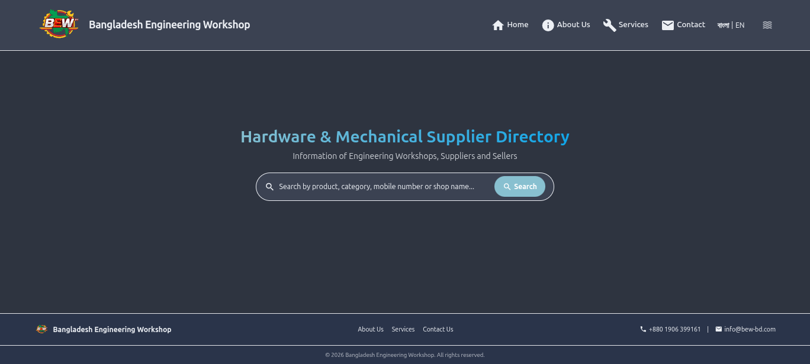
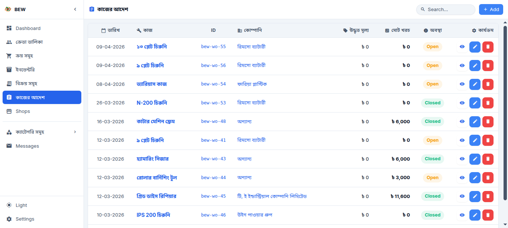

<p align="center">
  
</p>
<h1 align="center">Bangladesh Engineering Workshop</h1>

<p align="center">
  <strong>Hardware & Mechanical Supplier Directory + Business Management ERP</strong>
</p>

<p align="center">
  <a href="#features">Features</a> •
  <a href="#screenshots">Screenshots</a> •
  <a href="#tech-stack">Tech Stack</a> •
  <a href="#getting-started">Getting Started</a> •
  <a href="#project-structure">Project Structure</a> •
  <a href="#license">License</a>
</p>

<p align="center">
  
  
  
  
  
  
</p>

---

## Overview

A full-stack web application serving two roles:

1. **Public Directory** — A searchable supplier directory for hardware, mechanical, and engineering workshops in Bangladesh with TF-IDF powered semantic search.
2. **Admin Dashboard** — A complete ERP for managing buyers, purchases, inventory, sales, and work orders with multi-currency support, file attachments, and Bengali localization.

---

## Screenshots

### Public Website
<p align="center">
  
</p>

### Admin Dashboard
<p align="center">
  
</p>

---

## Features

### 🔍 Public Directory
- Semantic search powered by **TF-IDF vectorization** (scikit-learn)
- Shop profiles with contact details, products, and categories
- Bengali/English bilingual interface via Flask-Babel
- SEO-optimized with Open Graph tags and JSON-LD structured data

### 📊 Admin Dashboard
- **Buyers** — Company/client database with contact management
- **Purchases** — Track purchase orders with voucher file uploads
- **Inventory** — Stock management with unit tracking (Kg, Pcs, Box, Roll, etc.)
- **Sales** — Sales records with profit/loss calculations
- **Work Orders** — Production job management with parts gallery, cost breakdown, and status tracking
- **Shops** — Supplier directory management with category tagging

### 🎨 UI/UX
- Dark/Light/Matrix/Cream/Dracula theme switching via CSS design tokens
- Adjustable font scale (S/M/L/XL) with FOUC prevention
- Resizable sidebar with localStorage persistence
- Responsive layout for desktop and mobile
- Alpine.js reactive components (modals, live search, searchable selects)

### 🏗️ Architecture
- Clean Architecture with strict dependency flow (`config → schema → core → services → routers`)
- Centralized settings via Pydantic (`src/config/settings.py`)
- Centralized file operations — no raw `pathlib` or `os.path` outside `config/`
- Structured logging with rotating file handlers — zero `print()` statements
- Rate limiting on public endpoints via Flask-Limiter

---

## Tech Stack

| Layer | Technology |
|:------|:-----------|
| **Backend** | Python 3.13, Flask 3.1, SQLAlchemy 2.0 |
| **Database** | SQLite (file-based, zero-config) |
| **Search** | scikit-learn TF-IDF + cosine similarity |
| **Frontend** | Jinja2 templates, Tailwind CSS (CDN), Alpine.js |
| **Config** | Pydantic Settings, python-dotenv |
| **i18n** | Flask-Babel (Bengali + English) |
| **Security** | Flask-Limiter, password-protected delete operations |

---

## Getting Started

### Prerequisites
- Python 3.10+
- pip

### Installation

```bash
# Clone the repository
git clone https://github.com/mdnaimul22/bangladesh-engineering-workshop.git
cd bangladesh-engineering-workshop

# Create virtual environment
python -m venv .venv
source .venv/bin/activate  # Linux/macOS
# .venv\Scripts\activate   # Windows

# Install dependencies
pip install -r requirements.txt
```

### Configuration

Create a `.env` file in the project root:

```env
# Flask
SECRET_KEY=your-secret-key-here
APP_HOST=127.0.0.1
APP_PORT=5000
SQLALCHEMY_TRACK_MODIFICATIONS=False

# Localization
BABEL_DEFAULT_LOCALE=bn
BABEL_TRANSLATION_DIRECTORIES=translations

# Database
DATABASE_NAME=data/shop.db
DELETE_PASSWORD=your-delete-password
DELETE_PASSWORD_ENABLED=True

# Admin Login
ADMIN_USERNAME=admin
ADMIN_PASSWORD=your-admin-password

# Directories
LOG_DIR=data/logs
MODELS_DIR=data/models
UPLOAD_DIR=static/uploads
DATA_DIR=data

# Files
SHOPS_JSON=data/shops.json
ODT_FILE=data/shop_details.odt

# Business Info (SEO)
BUSINESS_NAME=Bangladesh Engineering Workshop
BUSINESS_DESC=Heavy machinery repair and engineering solutions
BUSINESS_ADDRESS=City Bypass, Mostofar Mor, Horintana, Khulna
BUSINESS_PHONE=+8801906399161
BUSINESS_EMAIL=info@bew-bd.com
BUSINESS_MAP_URL=https://maps.google.com/?q=22.8,89.5
BUSINESS_OPENING_HOURS=Sat-Thu 09:00-18:00
BUSINESS_OPEN_TIME=09:00
BUSINESS_CLOSE_TIME=18:00
BUSINESS_LATITUDE=22.8
BUSINESS_LONGITUDE=89.5
```

### Run

```bash
python main.py
```

The app will be available at `http://127.0.0.1:5000/`.

- **Public Directory**: `http://127.0.0.1:5000/`
- **Admin Dashboard**: `http://127.0.0.1:5000/dashboard/`

---

## Project Structure

```
bangladesh-engineering-workshop/
│
├── main.py                        # Entry point — Flask server
├── requirements.txt               # Python dependencies
├── .env                           # Environment configuration
│
├── src/
│   ├── config/                    # ⚙️ Settings, paths, file utilities, logger
│   ├── db/                        # 🗄️ SQLAlchemy models & database
│   ├── helpers/                   # 🔧 Auth, upload, search engine, utilities
│   ├── routers/                   # 🚪 Flask blueprints (HTTP interface)
│   ├── services/                  # 🧠 Business logic layer
│   │   └── search/                # TF-IDF model trainer
│   └── extensions.py              # Flask extensions (rate limiter)
│
├── static/
│   ├── css/                       # 🎨 Design tokens & component styles
│   ├── js/                        # ⚡ Alpine.js store & components
│   ├── img/                       # 🖼️ Static images
│   └── uploads/                   # 📁 User uploads (vouchers, gallery)
│
├── templates/
│   ├── layout.html                # Root layout (themes, fonts, FOUC)
│   ├── web_base.html              # Public site layout (navbar + footer)
│   ├── dashboard_base.html        # Admin layout (sidebar + topbar)
│   ├── components/                # Reusable Jinja2 macros
│   ├── web/                       # Public pages (about, services, contact)
│   └── dashboard/                 # Admin pages (CRUD for each module)
│
├── tests/                         # Test suite
├── docs/img/                      # Documentation screenshots
└── translations/                  # i18n message catalogs
```

---

## Testing

```bash
python -m pytest tests/ -v
```

---

## License

This project is licensed under the **MIT License** — see the [LICENSE](LICENSE) file for details.

---

<p align="center">
  Built with ❤️ in Khulna, Bangladesh
</p>
